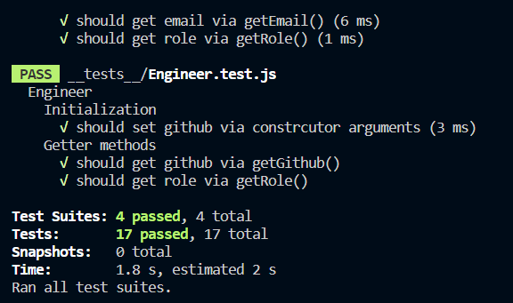
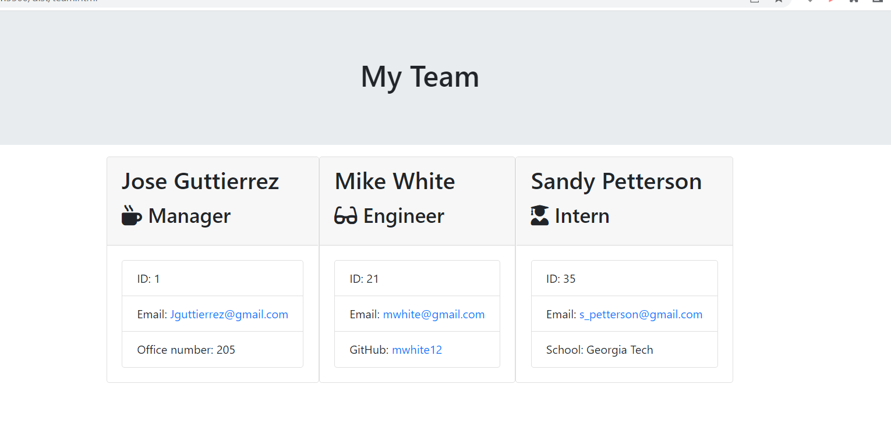

# Hw10-TeamProfileGenerator# HW6-WeatherDashboard

### This is Mikhail Sookwah's of creating a profile generator for employees

This program includes:

* A program that generates a profile list depending on the prompts the employees can entering

    * Each manager can enteir their name, email, id, ect. to generate their personal profile list

    * Each manager can also enter multiple ammount of employees working for them.

        * It can either be interns or regular employees

        * Stnadard Engineers and Interns have slightly different data to input from eachother,
        whether it's school name for interns or an engineers github information about

* This program also has passed through test files that make sure the program functions perfectly.

----------------------------------------------------------------

[Link to the website](https://github.com/Mikhail25/Hw10-TeamProfileGenerator)